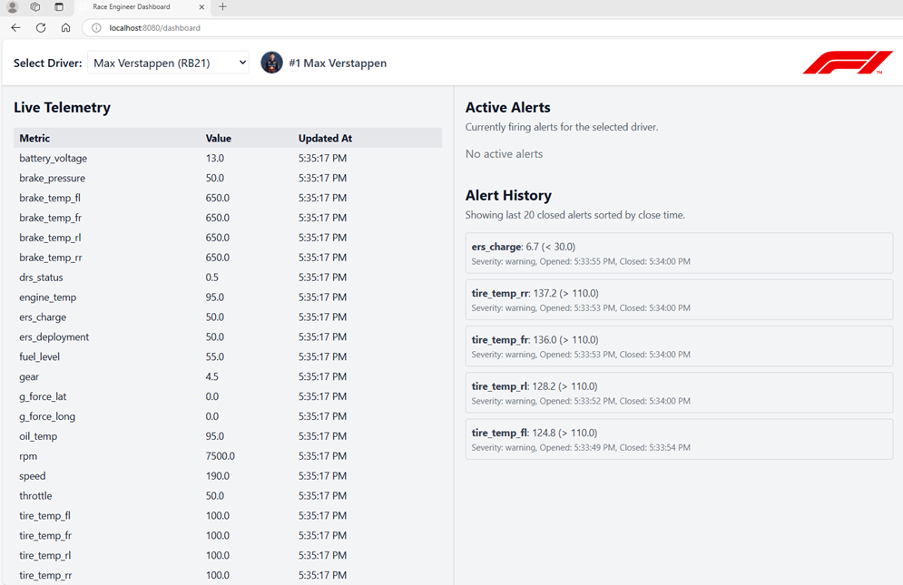
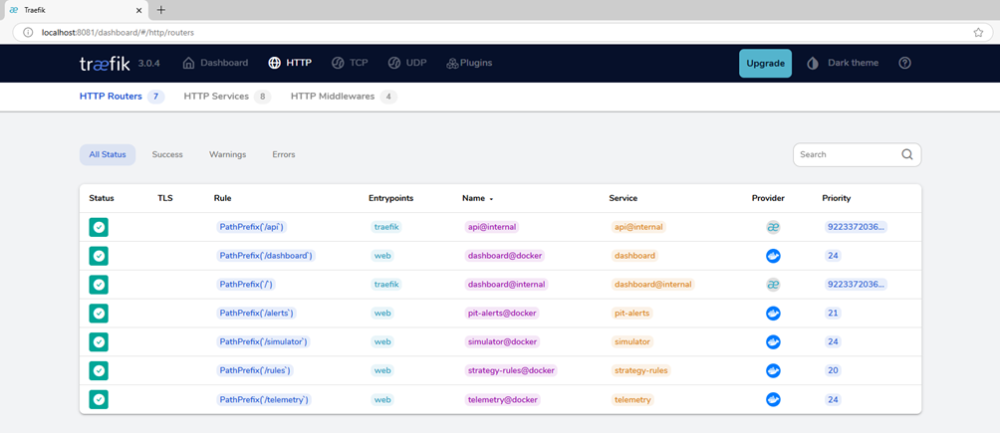
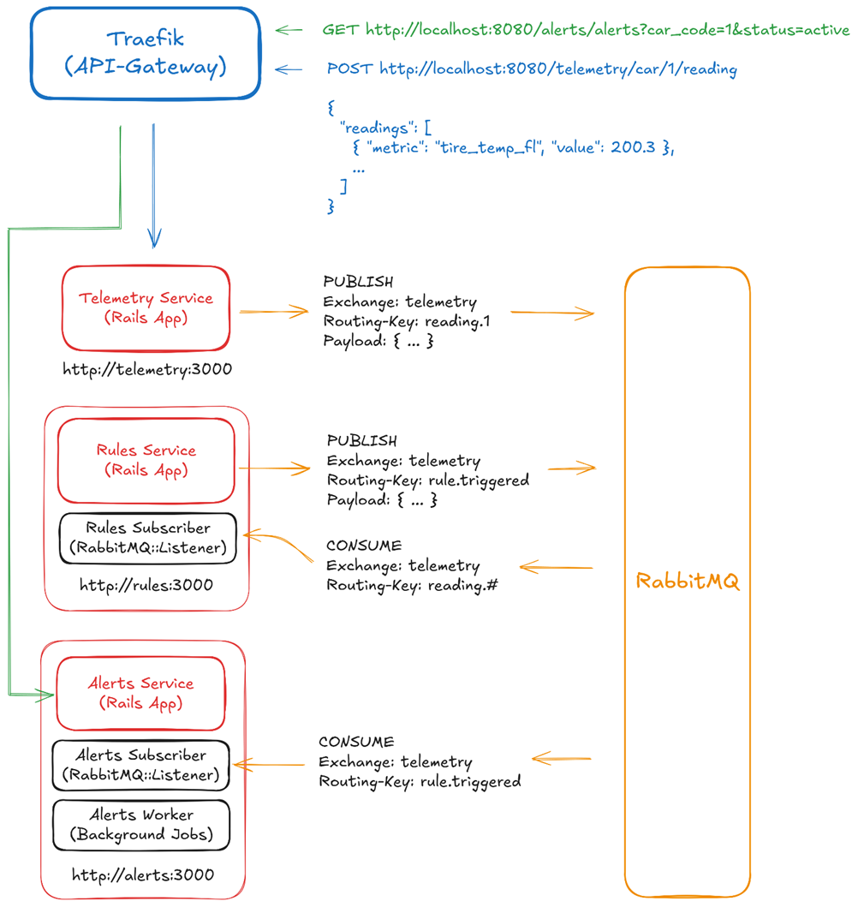
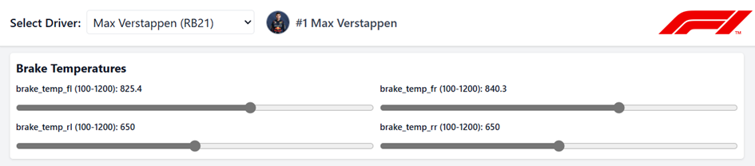

# F1 Telemetry & Alerting System


**A distributed microservices-based system designed for real-time monitoring of Formula 1 telemetry data.**

The system simulates race car metrics (e.g., tire temperature, brake pressure, ERS charge), evaluates them against engineering rules, and manages critical alerts for race engineers.

*Project created for the "Microservices-based Web Applications" course at the University of Rzeszów.*

Technologies used in this project:

<p>
  
  
  
  
  
  
  
  
  
</p>



## Overview

This project simulates a telemetry environment for F1 teams (specifically modeled around the 2024/2025 season). It allows for:
1.  **Simulation:** Generating real-time telemetry data for specific drivers (e.g., Max Verstappen, Lewis Hamilton).
2.  **Monitoring:** Ingesting high-frequency data streams via a REST API.
3.  **Rule Evaluation:** Asynchronous assessment of metrics against defined thresholds (e.g., `brake_temp_fl > 800°C`).
4.  **Alerting:** Lifecycle management of alerts (Open -> Active -> Closed) with automatic resolution logic.

The system is designed as a **Monorepo** orchestrating 5 distinct services and infrastructure components.

## Architecture

The system utilizes a microservices architecture managed by **Docker Compose**. Traffic is routed via **Traefik** (acting as an API Gateway and Reverse Proxy), and inter-service communication is handled asynchronously by **RabbitMQ**.


### Infrastructure Components
* **Traefik:** API Gateway & Service Discovery. Routes traffic from `localhost:8080` to internal containers.
* **RabbitMQ:** Message broker using Topic Exchange for decoupling Telemetry, Rules, and Alerts services.
* **PostgreSQL:** Dedicated database instances for each backend service (`telemetry-db`, `rules-db`, `alerts-db`).
* **Redis:** In-memory store for caching and background worker state.
* **Nginx:** Serves static frontend applications.

## Services



The repository is organized into the following services:

| Service | Directory | Type | Description |
| :--- | :--- | :--- | :--- |
| **Telemetry Service** | `/telemetry-service` | Backend (Rails) | Manages drivers/cars and ingests raw reading data. Publishes `reading.#` events. |
| **Rules Service** | `/rules-service` | Backend (Rails) | Manages engineering rules. Consumes readings, evaluates logic, and publishes `rule.triggered` events. |
| **Alerts Service** | `/alerts-service` | Backend (Rails) | Consumes triggered rules, creates/updates alerts, and auto-closes resolved issues via background workers. |
| **Dashboard** | `/dashboard-service` | Frontend (Nginx) | Real-time UI for race engineers to view telemetry and active alerts. |
| **Simulator** | `/simulator-service` | Frontend (Nginx) | Control panel to manually manipulate car metrics and simulate track behavior. |

## Event-Driven Communication

The system relies on an event-driven flow to process data without direct coupling between services.




1.  **Ingestion:** Simulator POSTs data to `Telemetry Service` (REST).
2.  **Publication:** `Telemetry Service` publishes payload to `telemetry` exchange with key `reading.<car_code>`.
3.  **Evaluation:** `Rules Subscriber` (listening on `reading.#`) processes the metric against active rules.
4.  **Trigger:** If a rule is breached, `Rules Service` publishes to `telemetry` exchange with key `rule.triggered`.
5.  **Alerting:** `Alerts Subscriber` consumes the trigger and creates/updates an Alert record.
6.  **Cleanup:** A background worker in `Alerts Service` monitors signal loss to auto-close alerts (approx. 3s timeout).

## Usage

### 1. Simulator
Select a driver (e.g., Max Verstappen) and adjust sliders for metrics like `tire_temp`, `brake_pressure`, or `fuel_level`. The simulator sends data every second.




### 2. Dashboard
Open the dashboard in a separate window. Select the same driver. You will see real-time updates. If you simulate a critical value (e.g., Brake Temp > 800°C), an alert will appear instantly in the "Active Alerts" panel.


## API Endpoints

Traffic is routed via Traefik. Base URL: `http://localhost:8080`.

**Telemetry Scope** (`/telemetry`)
* `GET /cars` - List all drivers.
* `POST /cars/:car_code/readings` - Submit new telemetry readings.
* `GET /cars/:car_code/readings/latest` - Get current state.

**Rules Scope** (`/rules`)
* `GET /rules` - List all engineering rules.
* `POST /rules` - Create a new rule.

**Alerts Scope** (`/alerts`)
* `GET /alerts?status=active` - Get currently firing alerts.
* `GET /alerts?car_code=1` - Filter alerts by driver.

## Installation & Setup

### Prerequisites
* Docker
* Docker Compose
* Ports available: `8080` (Gateway), `8081` (Traefik UI), `15672` (RabbitMQ Mgmt).

### Quick Start
1.  Clone the repository:
    ```bash
    git clone https://github.com/maciejb2k/f1-telemetry.git
    cd f1-telemetry
    ```

2.  Start the system:
    ```bash
    docker compose up -d --build
    ```
    *Note: The first launch performs database creation, migrations, and seeding. This may take a few minutes.*

3.  Access the applications:
    * **Simulator:** [http://localhost:8080/simulator](http://localhost:8080/simulator)
    * **Dashboard:** [http://localhost:8080/dashboard](http://localhost:8080/dashboard)
    * **Traefik Dashboard:** [http://localhost:8081](http://localhost:8081)
    * **RabbitMQ Management:** [http://localhost:15672](http://localhost:15672) (User/Pass: `guest`/`guest`)

## Tech Stack

**Backend:**
* **Ruby on Rails:** Core framework for Telemetry, Rules, and Alerts microservices.
* **Rake Tasks:** Used for background workers and RabbitMQ consumers.

**Frontend:**
* **HTML5 / JavaScript:** Lightweight SPA logic.
* **Tailwind CSS:** Styling for Dashboard and Simulator.

**DevOps & Infra:**
* **Docker & Docker Compose:** Containerization and orchestration.
* **RabbitMQ:** Event bus (`Topic` exchange).
* **PostgreSQL:** Relational data persistence.
* **Traefik v3:** Edge router.